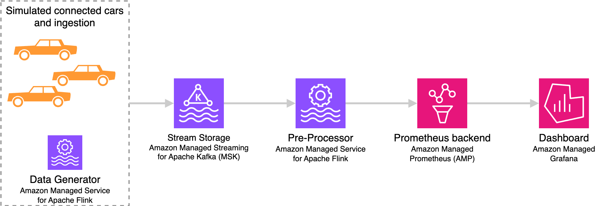
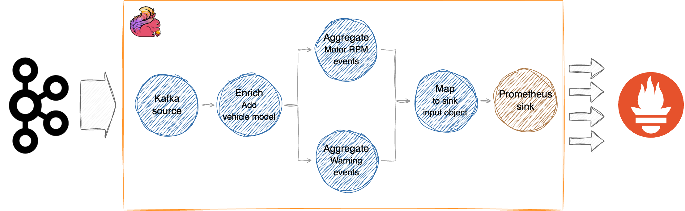

# Apache Flink Prometheus Connector demo - Vehicle IoT

This repository contains an end-to-end demo demonstrating the integration of Apache Flink and Prometheus
using the [Flink Prometheus connector](https://github.com/apache/flink-connector-prometheus).

The demo simulates a fleet of hybrid vehicles continuously emitting several types of telemetry events.

The goal is displaying real-time dashboards and setting up real-time alarms, using Prometheus and Grafana.

To make the telemetry event actionable, the raw events must be pre-processed using Apache Flink, before 
writing them to Prometheus.

The demo is designed to run on [Amazon Managed Service for Apache Flink](https://aws.amazon.com/managed-service-apache-flink/),
[Amazon Managed Streaming for Apache Kafka (MSK)](https://aws.amazon.com/msk/)
and [Amazon Managed Service for Prometheus (AMP)](https://aws.amazon.com/prometheus/), but it can be easily adapted to
any other Apache Flink, Apache Kafka and Prometheus versions.


## End-to-end architecture

The demo includes the following components:
1. [Vehicle event generator](./vehicle-event-generator): a Flink application generating simulated connected vehicle data 
   and writing into Kafka.
2. [Pre-processor](./pre-processor): a Flink application reading raw vehicle events from Kafka, pre-processing with 
   enrichment, reducing frequency via aggregation, reducing cardinality, and writing to Prometheus.
3. [Raw event writer](./raw-event-writer): a second Flink application reading raw vehicle events from Kafka, and writing
   them, without modifications, to Prometheus.




-- -- --

## Vehicle telemetry data and pre-processing

### Raw vehicle events

Example of raw vehicle events generated by [Vehicle event generator](./vehicle-event-generator):

```json
{
  "eventType": "IC_RPM",
  "vehicleId": "V0000012345",
  "region": "UK",
  "timestamp": 1730621749,
  "measurement": 4356
}
```

Dimension cardinality:
* `eventType`
  1. `IC_RPM`: Internal Combustion engine RPM gauge
  2. `ELECTRIC_RPM`: Electric motor RPM gauge (the fictional vehicles are hybrid)
  3. `WARNINGS`: Count warning lights currently on in the vehicle
* `region`: cardinality = 20
* `vehicleId`: configurable (see [Configuring Vehicle event generator](#configuring-vehicle-event-generator))

All events are written to a single Kafka topic, serialized as JSON.

### Pre-processing

The [Pre-processor](./pre-processor) application simulates the following operations:
1. Enrich raw events adding a `vehicleModel`, based on the `vehicleId`. In the real world this would happen looking up 
   a reference database, possibly pre-loading or caching the results. For simplicity, in this demo the map  
   `vehicleId` -> `vehicleModel` is hardwired.
2. Calculate derived metrics: Is the vehicle in motion? When either `IC_RPM` or `ELECTRIC_RPM` are not zero.
3. Reduce frequency and cardinality: Aggregate raw events by `vehicleModel` and `region` over 5 second windows (configurable).
4. Write the aggregate metrics to Prometheus.



### Aggregate metrics

Example of aggregate metric written by [Pre-processor](./pre-processor) to Prometheus:

```json
{
  "Labels": [
    { "name": "__name__", "value": "vehicles_in_motion" },
    { "name": "model", "value": "Nebulara" },
    { "name": "region", "value": "US" }
  ],
  "Samples": [
    { "timestamp": 1730621749, "value": 42.0 }
  ]
}
```

The two metrics written by [Pre-processor](./pre-processor) to Prometheus are:
1. `vehicles_in_motion`: Count of unique vehicles in motion in the 5 seconds time window, per `model`, per `region`
2. `warnings`: Count of vehicle warning lights on in the 5 seconds time window, per `model`, per `region`

Other dimensions cardinality:
* `region`: cardinality = 20 (from the raw events)
* `model`: cardinality = 8 (for simplicity, models are hardwired in the Pre-processor)

---

## Running the demo on AWS

You can run the demo on AWS, using [Amazon Managed Service for Apache Flink](https://aws.amazon.com/managed-service-apache-flink/),
[Amazon Managed Streaming for Apache Kafka (MSK)](https://aws.amazon.com/msk/), [Amazon Managed Service for Prometheus (AMP)](https://aws.amazon.com/prometheus/), 
and Amazon Managed Grafana.

### Set up using CDK

Use the [provided CDK stack](./cdk/README.md) to set up the VPC, the MSK cluster, build and deploy the Managed Service for Apache Flink applications.

### (Alternative) Manual set up

Alternatively, you can set up the resources manually, following the [step-by-step instructions](./docs/manual-step-by-step.md)

Additionally, you create and run 3 [Amazon Managed Service for Apache Flink](https://aws.amazon.com/managed-service-apache-flink/)
applications: 
1. Vehicle data generator
2. Pre-processor
3. Raw event writer 

### Set up Grafana

Regardless you create the stack using CDK or manually, some additional steps are required to set up Grafana and the dashboard, following [these instructions](./docs/grafana-setup.md).

---

## Run the demo locally, in IntelliJ

For testing and development, you can run the demo partly locally:

* Run the Flink applications, [Vehicle event generator](./vehicle-event-generator), [Pre-processor](./pre-processor),
  and [Raw event writer](./raw-event-writer) directly in IntelliJ. You do not need to install Apache Flink locally.
* Run Kafka locally using the provided [Docker compose stack](./kafka-docker). This simplifies the development setup not requiring access to MSK from your development machine.
* You can use Amazon Managed Prometheus and Amazon Managed Grafana when running the Flink application locally, without
  setting up any special connectivity, as long as on your machine you are using AWS credentials with 
  [Remote-Write permissions](#iam-permissions-to-use-amp-remote-write) to the AMP workspace.


See [Setup for running the demo locally](docs/local-setup.md) for details.

---

## Flink applications runtime configuration

Runtime configuration of the Flink jobs.

### Configuring Vehicle event generator

Runtime properties for [Vehicle event generator](./vehicle-event-generator).

To configure the application for running locally modify [this JSON file](./vehicle-event-generator/src/main/resources/flink-application-properties-dev.json).

| Group ID      | Key                        | Default          | Description                                                                                                                                                         |
|---------------|----------------------------|------------------|---------------------------------------------------------------------------------------------------------------------------------------------------------------------|
| `KafkaSink`   | `bootstrap.servers`        | N/A              | Kafka cluster boostrap servers, for unauthenticated plaintext                                                                                                       |
| `KafkaSink` | `topic`                    | `vehicle-events` | Topic name                                                                                                                                                          |
| `DataGen`     | `vehicles`                 | `1`              | Number of simulated vehicles                                                                                                                                        |
| `DataGen`     | `events.per.sec`           | n/a              | Number of simulated vehicle events generated per second                                                                                                             |
| `DataGen`     | `prob.motion.state.change` | `0.01`           | Probability of each simulated vehicle to change its motion status, every time an event for that vehicle is generated (double, between `0.0` and `1.0`)              |
| `DataGen`     | `prob.warning.change`      | `0.001`          | Probability the number of warning lights will change in each simulated vehicle, every time an event for that vehicle is generated (double, between `0.0` and `1.0`) |

> Note: the "probability" parameters are used to make the randomly generated data a bit more "realistic" but
> they are not really important for the demo.

### Configuring Pre-processor

Runtime properties for [Pre-processor](./pre-processor).

To configure the application for running locally modify [this JSON file](./pre-processor/src/main/resources/flink-application-properties-dev.json).

| Group ID         | Key                 | Default          | Description                                                                                                                                                         |
|------------------|---------------------|------------------|---------------------------------------------------------------------------------------------------------------------------------------------------------------------|
| `KafkaSource`    | `bootstrap.servers` | N/A              | Kafka cluster boostrap servers, for unauthenticated plaintext                                                                                                       |
| `KafkaSource`    | `topic`             | `vehicle-events` | Topic name                                                                                                                                                          |
| `KafkaSource`    | `group.id`          | `pre-processor`  | Consumer Group ID |
| `KafkaSource`    | `max.parallelism`   | N/A              | Max parallelism of the source operator. I can be used to limit the parallelism when the application parallelism is > partitions in the source topic. If not specified, the source uses the application parallelism. |
| `Aggregation`    | `window.size.sec`   | `5`              | Aggregation window, in seconds |
| `PrometheusSink` | `endpoint.url`      | N/A | Premetheus Remote-Write endpoint URL |
| `PrometheusSink` | `max.request.retry` | `100` | Max number of retries for write retryable errors (e.g. throttling) before the sink discard the write request and continue. |


### Configuring Raw event writer

Runtime properties for [Raw event writer](./raw-event-writer).

To configure the application for running locally modify [this JSON file](./raw-event-writer/src/main/resources/flink-application-properties-dev.json).


| Group ID         | Key                 | Default          | Description                                                                                                                                                         |
|------------------|---------------------|------------------|---------------------------------------------------------------------------------------------------------------------------------------------------------------------|
| `KafkaSource`    | `bootstrap.servers` | N/A              | Kafka cluster boostrap servers, for unauthenticated plaintext                                                                                                       |
| `KafkaSource`    | `topic`             | `vehicle-events` | Topic name                                                                                                                                                          |
| `KafkaSource`    | `group.id`          | `pre-processor`  | Consumer Group ID |
| `KafkaSource`    | `max.parallelism`   | N/A              | Max parallelism of the source operator. I can be used to limit the parallelism when the application parallelism is > partitions in the source topic. If not specified, the source uses the application parallelism. |
| `PrometheusSink` | `endpoint.url`      | N/A              | Premetheus Remote-Write endpoint URL |
| `PrometheusSink` | `max.request.retry` | `100`            | Max number of retries for write retryable errors (e.g. throttling) before the sink discard the write request and continue. |


---

## Prometheus quotas and throttling

Consult the [Amazon Managed Service for Prometheus Quotas](https://docs.aws.amazon.com/prometheus/latest/userguide/AMP_quotas.html) for the default maximum *Ingestion throughput per workspace*. 

If the ingestion to Prometheus exceed this limit, the Flink application is throttled. This can easily happen with the [Raw event writer](./raw-event-writer). We recommend to create a separate AMP workspace to test writing raw events.

Note that this limit is a soft quota. You can request a quota increase for real environment. Consult the [AMP Quota documentation](https://docs.aws.amazon.com/prometheus/latest/userguide/AMP_quotas.html) for details.
