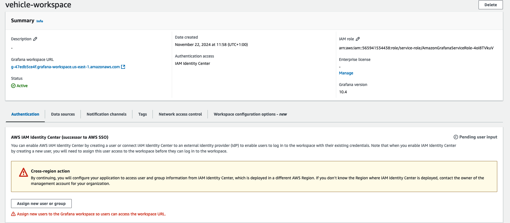

# CDK Deployment

Here you can find the instructions for deploying the following resources for the demo using CDK

- Amazon VPC
- Amazon MSK Cluster
- Amazon Managed Service for Prometheus
- Amazon Managed Service for Apache Flink Applications (Data Generator & Data Processor)
- CloudWatch Log groups and Log Streams
- AWS Lambda Functions for creating a Kafka Topic and starting the Flink applications.

## Pre-requisites

In order to deploy this solution you will need
- AWS Credentials and permissions for deploying CDK
- CDK Cli running with the latest version (2.168.0)
- Docker running.

We use Docker in order to build the required Lambda Layer for being able to create the Kafka topic and for packaging the Apache Flink Applications using Maven

## Deployment

Assuming you have already git cloned this repository and are in the cdk folder

1. Run ```npm install```
2. Run ```cdk bootstrap```
3. Run ```cdk deploy```

When prompted to confirm deploying the resources type ```yes```

The solution should take around 30 minutes to deploy

### Setting Up Grafana

1. Go to the Amazon Managed Grafana Console
2. Click **Create workspace**


3. Provide a name to the workspace ```vehicle-workspace```, leave the rest as default and click **Next**


4. For Authentication Access you have two options
   * AWS IAM identity Center. If you do not have it enabled, it will enable automatically by creating a user. You can learn more on the required permissions needed in the following link: (AWS Identity Center)[https://docs.aws.amazon.com/grafana/latest/userguide/authentication-in-AMG-SSO.html]
   * Security Assertion Markup Language

We will choose AWS Identity Center, it might prompt you to create an User.


5. For permission type we will select **Service Managed**
6. Leave Outbound VPC Connection as default


7. Leave Network Access Control as **Open Access**. If needed you can configure so only resources from a given VPC are able to reach the workspace


8. Leave **IAM Permission access settings** as default
9. For Data sources, please select **Amazon Managed Service for Prometheus** and click **Next**


10. Review the settings and click **Create workspace**

The workspace should be available in approximately 15 minutes.

#### Configure Grafana User

1. Head over to AWS Identity Center Console. Please make sure you deploy the solution in the same region where you have Identity Center Configured
2. Go to Users
3. Click **Add user**


4. Provide a given username. For example: **Admin** and email address. Email address must be valid, since you will receive your credentials through email
5. Leave the rest as default and click **Next**


6. Do not add the user to any group and click **Next**
7. Review all the information and click **Add user**

You should be receving an email with an invite to join Identity Center, please accept it. This will prompt you to provide a new password for the user

8. Once you have created your user, we need to go back to our Grafana Workspace so we can add the user as an Admin
9. Once it is active, click on the Workspace and in Authentication, click **Assign new user or group


10. Select your newly created user and click **Assign users and groups**
11. Once it is added, please select it, and click on **Action**, then click on **Make admin**. This will allow you to import the dashboard


#### Setting up the Dashboard

1. Back in the workspace click on the **Grafana workspace URL**
2. Use your user credentials to log in
3. Once you are in the Welcome Page of the Grafana Dashboard, head over to Apps and click on **AWS Data Sources** and **Data Sources**


4. For service choose **Amazon Managed Service for Prometheus**
5. For region select the region in which you deployed the solution
6. You should now see your workspace and after you have selected it, click on **Add 1 data source**


7. After doing so, at the bottom right corner, you should see the following option **Go to Settings**. Click on it as we need to modify the name of the data source
8. Rename the data source to just ```Prometheus```, go to the bottom and click **Save & test**
9. Go to Dashboards and click on **New**


10. Click on **Import**
11. Upload the **Connected-Vehicles-Dashboard.json** file which you can find on the /grafana folder and click **Import**


